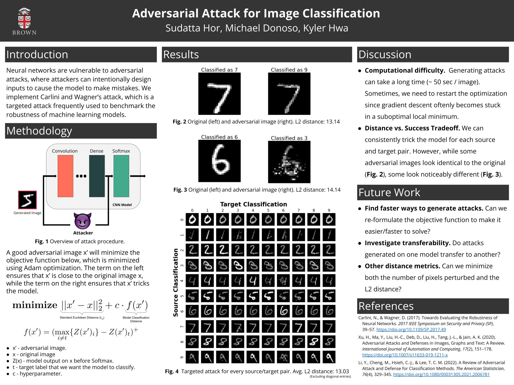

  

# Adversarial Attack for Image Classification

> **Click the emoji for Writeup: [😈](https://docs.google.com/document/d/1ozJ5GnrTGslRPNR5j9txo4anwz9y_g3Mq_1u2AyG8mM/edit?usp=sharing)**

Neural networks are vulnerable to adversarial attacks. Attackers can intentionally design inputs to cause the model to make mistakes. In our work, we attack convolutional neural networks (CNN) used to classify images in the MNIST dataset.

Many adversarial attacks exist (Biggio, Szegedy’s L-BFGS, Goodfellow’s FGSM), and are able to generate adversarial examples quickly. However, the defense strategy (distilled defense) proposed by (Papernot et al. 2016) was shown to be successful against these attacks. An attack proposed by Carlini and Wagner counterattacks this distilled defense strategy.

In our work, we implement Carlini and Wagner’s attack on a CNN used to classify digits from the MNIST dataset. The Carlini Wagner attack is a state-of-the-art attack in the field of adversarial machine learning, and has been frequently used to benchmark the robustness of machine learning models.

## References

Below is an algorithm that generates adversial examples. It is one of the recent powerful ones that is used as a benchmark to test a model's robustness.

[GitHub - Carlini & Walker](https://github.com/carlini/nn_robust_attacks)

[2017 - "Towards evaluating the robustness of neural networks" - Carlini & Walker](https://arxiv.org/pdf/1608.04644.pdf)

Below are reviews of adversial attacks. There is a Github repo associated with one of the papers.

[GitHub - A Review of Adversarial Attack and Defense for Classification](https://github.com/liyao880/revew_adv_defense)

[2021 - "A Review of Adversarial Attack and Defense for Classification" - Li](https://arxiv.org/pdf/2111.09961.pdf)

[2019 "Adversarial Attacks and Defenses in Images, Graphs and Text: A Review" - Xu](https://arxiv.org/pdf/1909.08072.pdf)

Below describe physical attacks. These are the "tape on a stop sign" papers.

[2018 "Physical Adversarial Examples for Object Detectors" - Eykholt](https://arxiv.org/pdf/1807.07769.pdf)

[2018 "Robust Physical-World Attacks on Deep Learning Visual Classification" - Eykholt](https://arxiv.org/pdf/1707.08945.pdf)

Below describes a defense that is effective against earlier attacks (Goodfellow's FGSM and Szegedy’s L-BFGS).

[2016 "Distillation as a Defense to Adversarial Perturbations against Deep Neural Networks" - Papernot](https://arxiv.org/pdf/1511.04508.pdf)

Earlier works propose that existence of adversial examples in neural networks arise since the models do not generalize well, which may be due to their high complexity. However, the following work shows that even linear models are vulnerable. The authors describe a simple method (a.k.a. Fast Gradient Sign Method FGSM) to generate adversial examples, and uses adversial training to reduce error on MNIST classification.

[2015 "Explaining and Harnessing Adversial Examples" - Goodfellow](https://arxiv.org/pdf/1412.6572.pdf)
